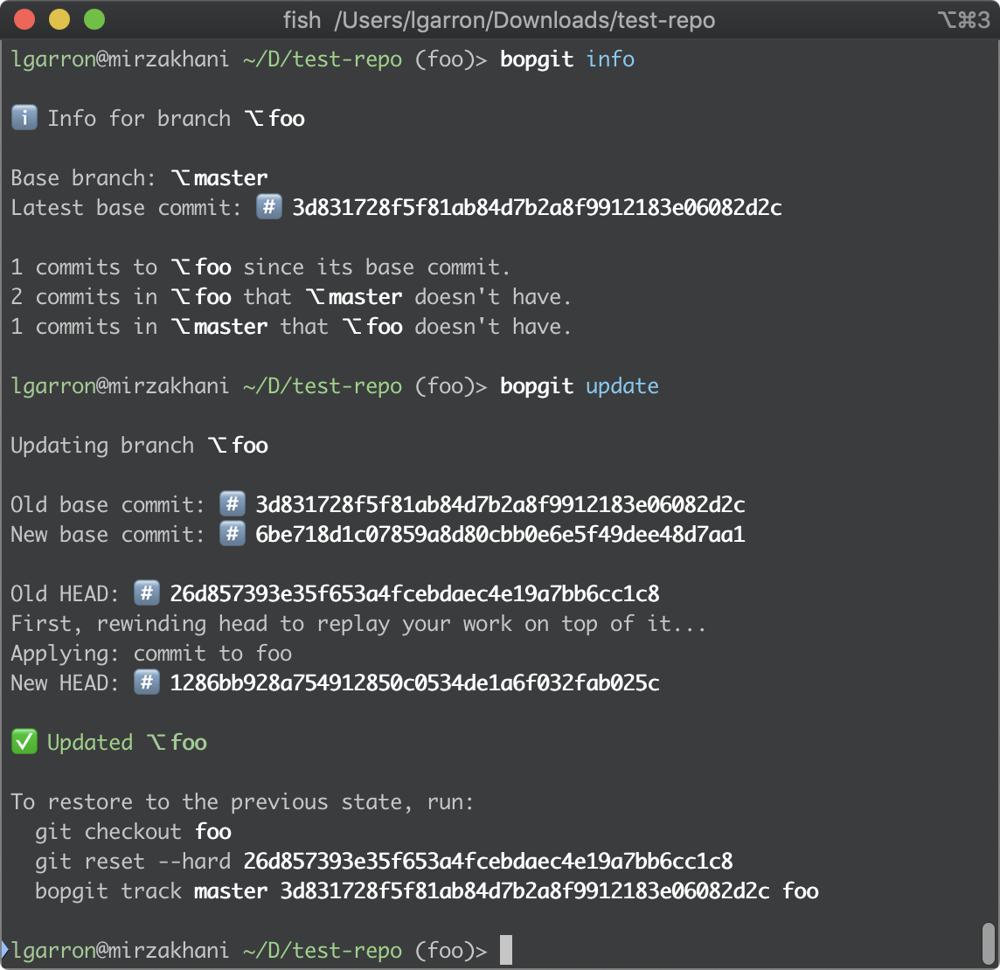

# `bopgit`

Obsolete. Use `jj` instead: https://jj-vcs.github.io/jj/latest/

 
 
 
Original README below:

--------

A fancy tracker for `git rebase --onto`.

I tend to work with a lot of dependent branches, and I prefer rebasing (instead of merging) in order to keep the dependencies understandable. I like the idea of [`topgit`](https://github.com/mackyle/topgit), but it seems to require extra commits to track dependencies (which show up in code reviews for normal repos). So I made `bopgit`, which does the minimum amount that I need without changing normal `git` operations.

# Install

    git clone https://github.com/lgarron/bopgit
    cd bopgit
    go install

# Example

Set one branch to track another:

    git checkout master
    git checkout -b foo
    bopgit track master

    # ... now modify `master` and `foo` independently

    git checkout foo
    bopgit info
    bopgit update

    # bopgit replays the commits from `foo` onto the latest `master`

## Explanataion

`bopgit` tracks two properties for a branch:

- The **base branch** it depends on.
- The **last base commit** where it was in sync with the base branch.

`bopgit update` brings the last base commit up to date, by running:

    git rebase --onto base-branch last-base-commit current-branch

`bopgit` automatically updates the `last-base-commit` so that you can perform arbitrary independent modifications on each branch and just run `bopgit update` when you want to get them in sync for e.g. code review.

`bopgit` tracks all its information under `refs/bopgit`, so all your existing git operations should work as normal.

## Caveats

If you perform a manual rebase that changes/removes the last base commit of a branch, you'll have to tell `bopgit` about the updated last base commit: `bopgit track master updated-last-base-commit`

# Limitations

- Only linear dependencies (no DAG).
